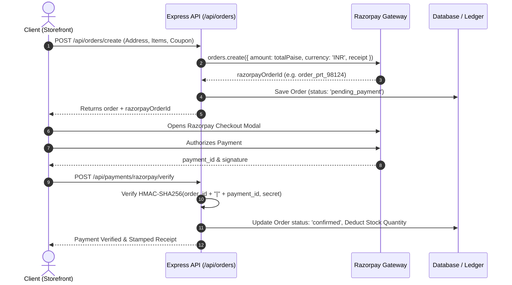

# Payments, Checkout & Fulfillment State Machine

## 1. Razorpay Integration Architecture

Pratie implements the standard enterprise Razorpay integration lifecycle:



---

## 2. Cryptographic HMAC Signature Verification

When a payment succeeds, Razorpay returns:
- `razorpay_order_id`
- `razorpay_payment_id`
- `razorpay_signature`

The backend verifies the authenticity using Node.js `crypto`:
```typescript
import crypto from 'crypto';

const generatedSignature = crypto
  .createHmac('sha256', process.env.RAZORPAY_KEY_SECRET!)
  .update(`${razorpayOrderId}|${razorpayPaymentId}`)
  .digest('hex');

const isValid = (generatedSignature === razorpaySignature);
```

---

## 3. Financial Integrity: Tax & Coupon Calculation

All calculations are performed on integer Paise:

1. **Subtotal Calculation**:
   $$\text{SubtotalPaise} = \sum (\text{BasePricePaise} + \text{VariantAdditionalPaise}) \times \text{Quantity}$$

2. **Coupon Discounting**:
   - **Percentage Discount** (`'percentage'`, e.g., 10%):
     $$\text{Discount} = \min\left(\text{round}\left(\frac{\text{SubtotalPaise} \times \text{DiscountValue}}{100}\right), \text{MaxDiscountCap}\right)$$
   - **Fixed Amount Discount** (`'fixed_amount'`, e.g., ₹2,000 off = `200000` Paise):
     $$\text{Discount} = \min(\text{DiscountValue}, \text{SubtotalPaise})$$

3. **Tax & Delivery Calculation**:
   - **Discounted Subtotal**: $\max(0, \text{SubtotalPaise} - \text{Discount})$
   - **GST Tax (18%)**: $\text{round}(\text{DiscountedSubtotal} \times 0.18)$
   - **Shipping**: Complimentary (₹0) on orders over ₹5,000 (`500000` Paise), otherwise ₹499 (`49900` Paise).
   - **Total Payable**: $\text{DiscountedSubtotal} + \text{GST} + \text{Shipping}$

---

## 4. Order Lifecycle State Machine

An order strictly transitions through the following valid states:

```
[ pending_payment ]
         │
         ├─── (Payment Captured / COD) ───► [ confirmed ] (Stock Deducted)
         │                                       │
         └─── (Payment Timeout / Abandon)        ├─── (Fulfillment Prep) ───► [ processing ]
                     │                                                             │
                     ▼                                                             ├─── (Consignment Dispatched) ───► [ shipped ]
               [ cancelled ]                                                       │                                      │
                                                                                   ▼                                      ├─── (Out for Delivery) ───► [ out_for_delivery ]
                                                                             [ cancelled ]                                │                                      │
                                                                                                                          ▼                                      ▼
                                                                                                                    [ returned ] ◄────────── [ delivered ] ◄─────┘
                                                                                                                         │                         │
                                                                                                                         ▼                         ▼
                                                                                                                    [ refunded ]              [ completed ]
```

### Transition Enforcement
The `OrderService.isValidTransition(currentStatus, nextStatus)` method prevents invalid jumps (e.g. `pending_payment` cannot be marked `delivered` without prior payment confirmation).
